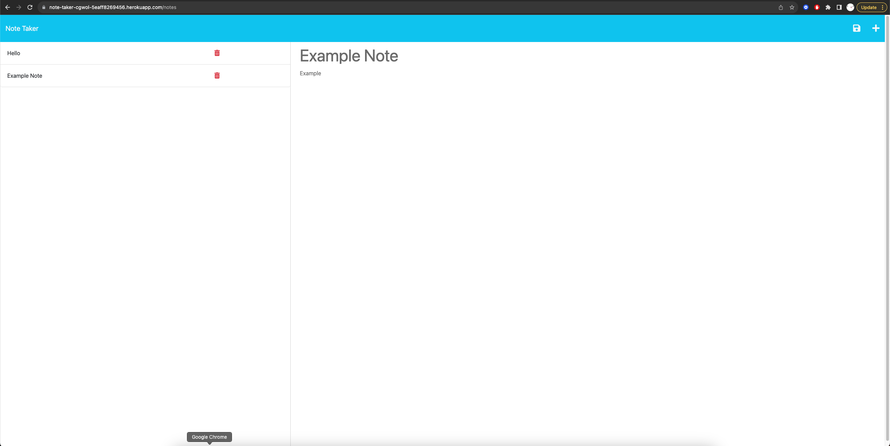

# Challenge 11 Note Taker

## Description 
  This application will use an Express.js back end and will save and retrieve note data from a JSON file.

## Table of Contents
  
  - [Description](#description)
  - [Installation](#installation)
  - [Usage](#usage)
  - [License](#license)
  - [Questions](#questions)

## Installation
  Install with node using node with the command line input 
  
    npm install

  in the command line

## Usage
  run app by using 
  
    node server.js

  in the command line for a local server (PORT 3001)

  [Live Heroku Deployment Link](https://note-taker-cgwol-5eaff8269456.herokuapp.com/notes)

  

## License
  This application is licensed under the [MIT](https://choosealicense.com/licenses/mit/) license
  
## Questions
  Created by: [cgwol](https://github.com/cgwol/)
  
  Contact with any further questions at [cgwalterson@icloud.com](mailto:cgwalterson@icloud.com)
  